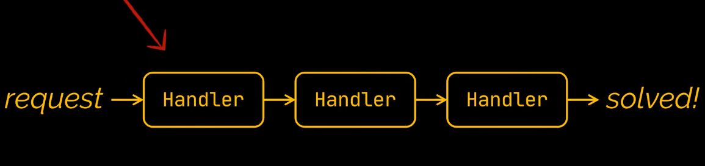
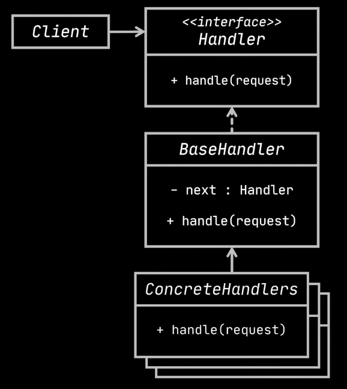
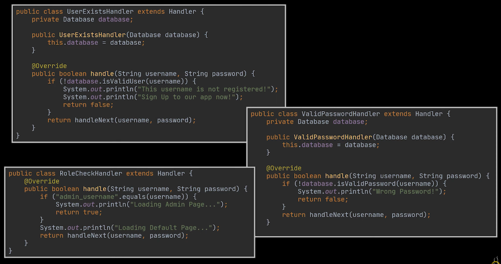

## Chain of Responsibility 

---

---
- **Behavioural Design Pattern**
- Transforms particular behaviors into stand-alone objects called handlers


```java
public class Database {
    private final Map<String, String> users;

    public Database() {
        users = new HashMap<>();
        users.put("admin_username", "admin_password");
        users.put("user_username", "user_password");
    }

    public boolean isValidUser(String username) {
        return users.containsKey(username);
    }

    public boolean isValidPassword(String username, String password) {
        return users.get(username).equals(password);
    }
}
```

```java
public interface Handler {
    boolean handle(String username, String password);
}
```

```java
import java.util.logging.Handler;

public abstract class BaseHandler {
    private Handler next;

    public Handler setNextHandler(Handler next) {
        this.next = next;
        return next;
    }

    public abstract boolean handle(String username, String password);

    protected boolean handleNext(String username, String password) {
        if (next == null) {
            return false;
        }
        return next.handle(username, password);
    }
}
```
---
### Handlers



---
### Why ?
- Use this pattern when you encounter the need to execute several handlers in particular order.
- Allows you to insert, remove or reorder handlers dynamically
- Each handler must make either process the request or pass along the chain
---