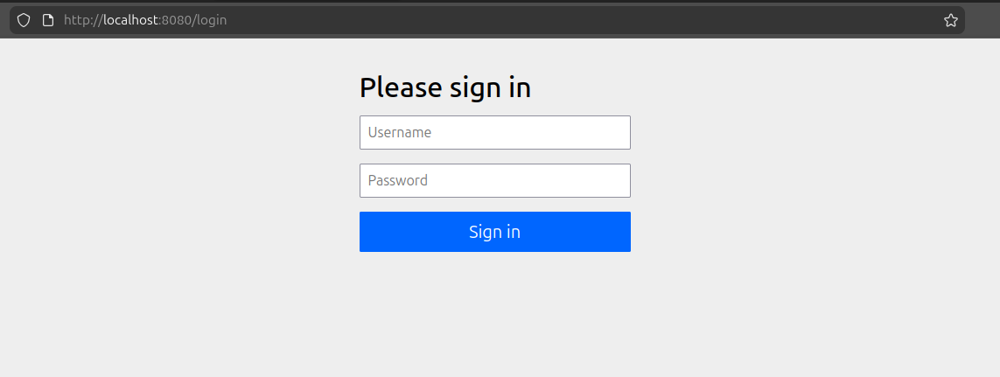
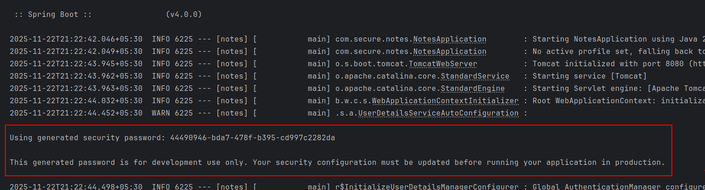
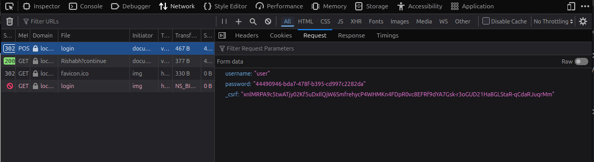
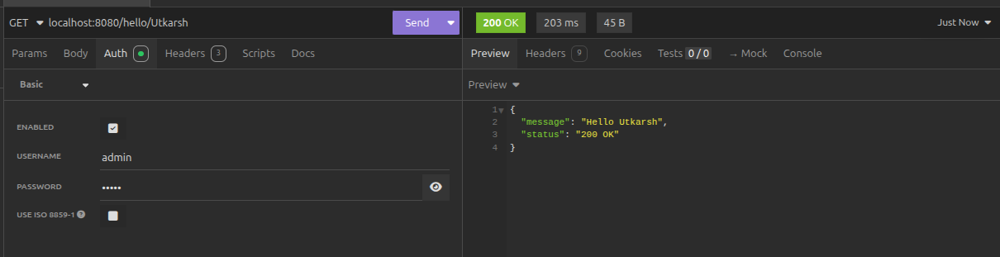
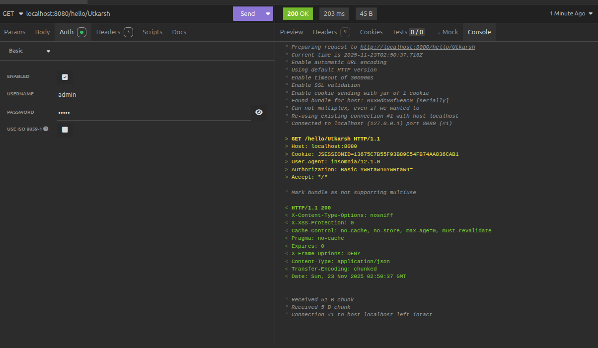
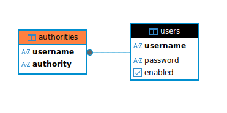

### Spring Security Introduction

- As soon as the spring-security dependency is added to the project
- Due to the Spring Boot's Auto configuration, and spring security's default behavior
- We get the following screen while accessing the `/hello/{name}` API endpoint
  
- The password is auto generated, and all the endpoints are protected by it
  
- Username by default is "user"
- We have a `/login` page, and also a `/logout` page
- Default authentication is **Form based authentication**
- When we make a call to any of the endpoints we will be redirected to the form
  

```
2025-11-22T21:40:55.469+05:30  WARN 7875 --- [notes] [           main] .s.a.UserDetailsServiceAutoConfiguration : 

Using generated security password: 8734ea81-8d28-4375-b816-801a8d7dd5f3

This generated password is for development use only. Your security configuration must be updated before running your application in production.

2025-11-22T21:40:55.523+05:30  INFO 7875 --- [notes] [           main] r$InitializeUserDetailsManagerConfigurer : Global AuthenticationManager configured with UserDetailsService bean with name inMemoryUserDetailsManager
2025-11-22T21:40:55.719+05:30 DEBUG 7875 --- [notes] [           main] o.s.s.web.DefaultSecurityFilterChain     : Will secure any request with filters: DisableEncodeUrlFilter, WebAsyncManagerIntegrationFilter, SecurityContextHolderFilter, HeaderWriterFilter, CsrfFilter, LogoutFilter, UsernamePasswordAuthenticationFilter, DefaultResourcesFilter, DefaultLoginPageGeneratingFilter, DefaultLogoutPageGeneratingFilter, BasicAuthenticationFilter, RequestCacheAwareFilter, SecurityContextHolderAwareRequestFilter, AnonymousAuthenticationFilter, ExceptionTranslationFilter, AuthorizationFilter
```

#### Making the Password Static

```properties
# Making Password Static as to not have it change with each run
spring.security.user.name=admin
spring.security.user.password=admin
```

---

#### Debugging

- `AuthorizationFilter`: makes the url restricted
    - `doFilter()` comes from the base class `GenericFilterBean`
- `UsernamePasswordAuthenticationFilter`
    - `return this.getAuthenticationManager().authenticate(authRequest);`
    - Here `AuthenticationManager` interface implementation is used

```java
import org.springframework.security.core.Authentication;
import org.springframework.security.core.AuthenticationException;

public interface AuthenticationManager {
    //..
    Authentication authenticate(Authentication authentication) throws AuthenticationException;
}
```

- `AuthenticationProvider` are usually tried in order until one provides a non-null response.
- `DaoAuthenticationProvider` is provided by Spring-Security by default
    - If the authentication password is matched the Authentication object is updated
- `DefaultLoginPageGeneratingFilter` class is responsible for generatingSecurityContextPersistenceFilter the page
  initially loaded whenever APIs are called
- `LogoutPageGeneratingWebFilter` generates the default logout page

---

### Making call using client




- Authorization is sent in an encoded format of Base64 like this `Authorization: Basic YWRtaW46YWRtaW4=`
- When we decrypt it, it becomes `admin:admin` `<username>:<password>`
- Spring security internally handles this decrypting logic

---

### Key Filters

1. `SecurityContextPersistenceFilter`: manages security context for each request
2. `WebAsyncManagerIntegrationFilter`: integrates the SecurityContext with Spring's WebAsyncManager for asynchronous web
   requests.
3. `HeaderWriterFilter`: Adds security related HTTP headers to the response, such as `X-Content-Type-Options`,
   `X-Frame-Options`, and `X-XSS-Protection`
4. `CorsFilter`: Handles Cross-Origin resource sharing (CORS) by allowing or denying requests from different origins
   based on configured policies
5. `CsrfFilter`: Enforces Cross-Site Request Forgery (CSRF) protection by generating and validating CSRF token for each
   request
6. `LogoutFilter`: Manages the logout process by invalidating the session, clearing the cookies, and redirecting the
   user to a configured logout success URL.
7. `UsernamePasswordAuthenticationFilter`: processes authentication requests for username and password credentials. It
   handles the form-based login process
8. `DefaultLoginPageGeneratingFilter`: generates a default login page if no custom login page is provided
9. `DefaultLogoutPageGeneratingFilter`: generates a default logout page if no custom logout page is provided
10. `BasicAuthenticationFilter`: Handles HTTP Basic authentication by extracting credentials from the Authorization
    header and passing them to the authentication manager.
11. `RequestCacheAwareFilter`: Ensures that the original requested URL is cached during authentication, so that the user
    can be redirected to it after successful authentication.
12. `AnonymousAuthenticationFilter`: provides anonymous authentication for users who are not authenticated. This is
    useful to apply security constraints even to unauthenticated users.
13. `ExceptionTranslationFilter`: Translates authentication and access-related exceptions into appropriate HTTP
    response, such as redirecting to the login page or sending a 403 Forbidden status
14. `FilterSecurityInterceptor`: Enforces security policy(authorization checks) on secured HTTP requests. It makes final
    access control decisions based on the configured security metadata and the current Authentication.

---

### JSessionID

- cookie that is being created to manage sessions
- once you have been authenticated you do not need to provide login username and password
- it will be stored in the cookies
- along with the login credentials, _csrf token is also sent in the request which is hidden by default

---

### Basic Authentication

- username:password -> Base64 Encoding -> Authorization Header Basic <base64 encoded value>
- `SpringBootWebSecurityConfiguration`: default configuration for web security
    - If the user specifies their own `SecurityFilterChain` bean, this will back-off completely and the user should
      specify
    - all the bits they want to configure as part of the custom security configuration

---

### `@AuthenticationPrincipal`

- It injects the information of the Authenticated user in the parameter

---

- By default, the Spring Security expects a _csrf token for all the requests trying to modify anything.

---

---

### Authentication Provider

- Authenticate the user
- Create the authentication token

#### Importance :

1. Flexibility
2. Separation of Concerns
3. Extensibility
4. Security

### Implementations of `AuthenticationProvider`

1. `DaoAuthenticationProvider`: Default
2. `InMemoryAuthenticationProvider` : Simple, good for POC
3. `LdapAuthenticationProvider`
4. `ActiveDirectoryLdapAuthenticationProvier`
5. `PreAuthenticatedAuthenticationProvider`: For Single Sign-on
6. `OAuth2AuthenticationProvider`

---

### UserDetails

- Stores user level logging information

```java
String getUsername();
String getPassword();
Collection<? extends GrantedAuthority> getAuthorities();
boolean isAccountNonExpired();
boolean isAccountNonLocked();
boolean isCredentialsNonExpired();
boolean isEnabled();
```

- `User` is concrete implementation of `UserDetails` interface provided by Spring Security

### UserDetailsService

- The `UserDetailsService` interface is responsible for retrieving user-related data.
- It has a single method that loads a user based on the username and returns a `UserDetails` object

```java
UserDetails loadUserByUsername(String username) throws UsernameNotFoundException;
```

### UserDetailsManager

- The `UserDetailsManager` interface in Spring Security extends, `UserDetailsService` and provides additional methods
  for managing user accounts.
- It has all the queries built in the class
- Two implementations : `JdbcUserDetailsManager` & `InMemoryUserDetailsManager`

---

``` 
create table users(username varchar_ignorecase(50) not null primary key,password varchar_ignorecase(500) not null,enabled boolean not null);
create table authorities (username varchar_ignorecase(50) not null,authority varchar_ignorecase(50) not null,constraint fk_authorities_users foreign key(username) references users(username));
create unique index ix_auth_username on authorities (username,authority);
```




Continue: https://www.udemy.com/course/spring-security-6-with-reactjs-oauth2-jwt-multifactor-authentication/learn/lecture/45118417#learning-tools


